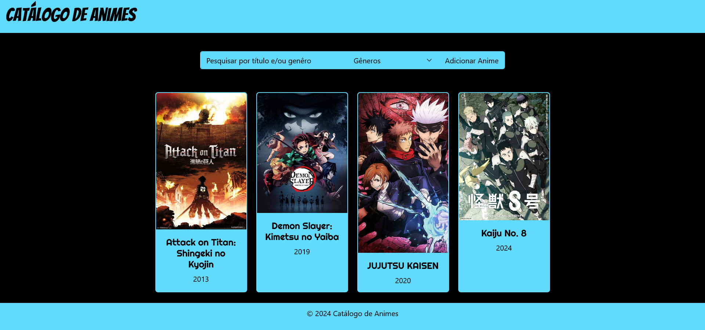

# Catálogo de Animes

---

O site é composto por:

- 📜 **Header**: Header com o nome do site "Catálogo de Animes".

- 🔍 **Barra de pesquisa**: Busca animes pelo título e gênero. Também conta modal para cadastrar novos animes.

- 📝 **Formulário**: Contém os campos título, descrição, poster, trailer, gêneros, ano de lançamento, classificação indicativa e temporadas e/ou filmes. Por enquanto, só possui 3 validações: para título, poster e gênero.

- 🎥 **Card de animes**: Exibe todos os animes que estão no banco. Ao clicar em um, mostra todos os detalhes deste anime.

- ❌ **Botão delete**: Deleta o anime exibido.

- 📅 **Footer**: Apresenta o copyright.

---

## ⚙️ Rodar projeto

Abra duas janelas no terminal, na primeira:

    npm install
    npm start

Na segunda:

    npm install -g json-server
    json-server --watch db.json -- port 3005

---

## 💻 Tecnologias utilizadas neste projeto

---

<h2>♉ Autora: Janaina da Silva</h2>

    
    

